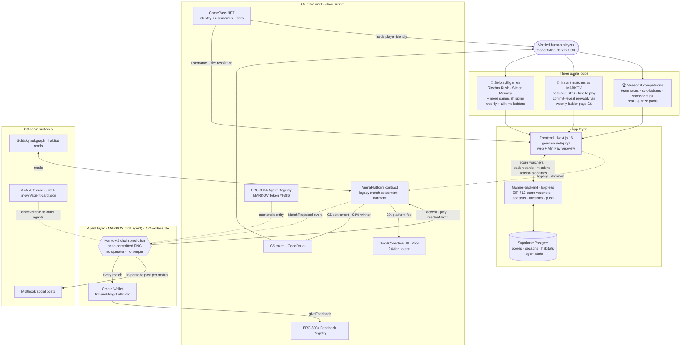
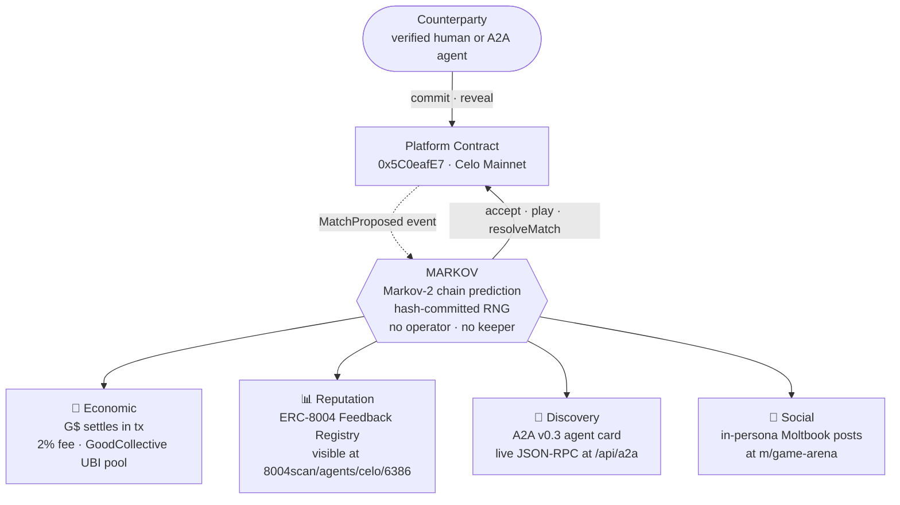

# GameArena

> Quick skill games that make you sharper. Verified humans with no bots, an AI that learns how you play, and real GoodDollar (G$) you earn every day · on Celo Mainnet, all on-chain and auditable.

[](https://gamearenahq.xyz)

[](https://gamearenahq.xyz)
[](https://t.me/gamearenaHQ)
[](https://celoscan.io/address/0x5C0eafE7834Bd317D998A058A71092eEBc2DedeE)
[](https://8004scan.io/agents/celo/6386)
[](https://karmahq.xyz/project/gamearena)

**Live:** [gamearenahq.xyz](https://gamearenahq.xyz)
**Community:** [t.me/gamearenaHQ](https://t.me/gamearenaHQ)
**Analytics:** [dune.com/ogazboiz/gamearena](https://dune.com/ogazboiz/gamearena)

---

## What is GameArena? (in plain words)

GameArena is a set of quick games that actually make you sharper. Each game trains a real skill:

- **Simon Memory** · trains your memory
- **Stack Tower** · trains patience and precision
- **Rhythm Rush** · trains focus and timing
- **Challenge AI** · go head-to-head with MARKOV, an AI that learns how you play

Thirty seconds a game, but you feel yourself improve. Everyone playing is a real, verified person, so there are no bots. Play is free · sign in with Google to rank, verify once and earn G$ every single day. You climb leaderboards against actual people, and the value is a bonus, not the bait. Built mobile-first for MiniPay, so anyone with just a phone in Nigeria and across Africa can play.

That's it. Come play: **[gamearenahq.xyz](https://gamearenahq.xyz)**

---

## Why we built this

Two problems.

When we're tired we reach for the phone, scroll, and feel worse. GameArena is a short break that gives something back: quick games that leave you sharper. A reset, not an escape.

And web3 rewards never reached real people. To earn crypto you needed a wallet, you needed gas, and once you got past that, bots had already farmed the rewards. We built the opposite: sign in with Google and play with zero gas, every player is a verified human so no bot ever wins, and real value comes as a bonus rather than the bait. Through GoodDollar, verified players earn a daily basic income, which matters most for players in emerging markets.

---

## How it works (the technical version)

Every player is identity-verified via the GoodDollar Identity SDK before they can score, earn, or claim · no bots, no sybil, no farming. Three live game loops run in parallel · skill-based solo games (Rhythm Rush, Simon Memory, Stack Tower), free instant matches against MARKOV (an AI opponent that models your patterns · provably fair via commit-reveal), and weekly + seasonal competitions with real G$ prize pools.

G$ is the currency. Players earn it from the daily GoodDollar claim, weekly ladder pools, and community challenges, and spend it on perks, cosmetics, and pet habitat tiers. Every spend splits on-chain in one transaction · 20% streams to the GoodCollective UBI pool, 80% to treasury · and every payout is an on-chain G$ transfer. The chain is the source of truth, the leaderboards are just the UX.

Built community-first · auto-balanced team races, weekly + all-time skill ladders, daily missions, milestone achievements, tier badges, play streaks, and a habitat economy where players spend G$ on cosmetic upgrades that compound into season standings. Daily and seasonal action is announced through the [Telegram community](https://t.me/gamearenaHQ).

---

## From the community

> there are days you'd just feel tired & overwhelmed and all you might need to cool off might be some games :)
>
> @Gamearenahq is a social community that's supports multiple fun games and community tasks.
>
> with live leader-boards, chill prizes and fun games to play.
>
> gamearena is positioning as the onchain environment you'd need to have fun!
>
> let's game!!

---

## Architecture



### Three game loops on one shared platform

**🎵 Solo skill games**

Rhythm Rush, Simon Memory, and Stack Tower today, with more games shipping into this slot. Plays submit EIP-712 score vouchers to the backend, which writes them to the activity ledger that powers weekly + all-time leaderboards.

**🤖 Instant matches vs MARKOV**

Free best-of-5 Rock-Paper-Scissors against an AI that builds a Markov model of every opponent. Matches are instant (the chain is the receipt layer, not the game loop) and provably fair: MARKOV's moves are hash-committed before round 1 and the seed is revealed after, so every match replays. Wins climb a weekly ladder; the pool pays top climbers in G$.

**🏆 Seasonal competitions**

Every action across all loops · games played, MARKOV wins, daily claims, referrals, active days · aggregates into points the season engine ranks against the prize-pool tiers.

---

### Designed for extensibility

- **New skill game** · ship a frontend client + scoring rules. No contract redeploy.
- **New agent game** · add it to MARKOV's strategy module. The instant-match engine and ladder carry it.
- **New agent entirely** · register on the same ERC-8004 registry. MARKOV is the first agent on the platform, not the only one it can host · A2A v0.3 discovery means any compliant agent plugs into the same surfaces.
- **Multi-platform reach** · the frontend works on the web AND inside MiniPay's webview from the same surface · no separate build.

---

### Four supporting systems

| System | What it does |
|---|---|
| **App layer** | UX, score pipeline, seasons, missions, push notifications. Frontend on Vercel, backend on Railway, state in Supabase Postgres. |
| **Celo Mainnet contracts** | Hold the money · ArenaPlatform (A2A wagers), GamePass NFT (scores), HabitatRegistry + PerkShop (G$ sinks), G$ token, GoodCollective UBI pool. |
| **MARKOV agent** | Autonomous opponent · no operator, no keeper. Markov-2 chain prediction + commit-reveal fairness. Instant Arena rounds run server-side for speed; the seed commitment makes every match replayable and verifiable. On-chain wager interface stays live for agent counterparties. |
| **Off-chain surfaces** | Make agent activity legible · Moltbook posts (humans), A2A discovery (other agents), Goldsky subgraph (analytics). |

Scores, habitat unlocks, and A2A wagers write to Celo first · the database mirrors chain state for those. Instant Arena matches settle server-side with a commit-reveal receipt.

For MARKOV's internal four-layer architecture (Economic · Reputation · Discovery · Social), see the [MARKOV section](#markov--autonomous-on-chain-ai-opponent) or [agent/README.md](agent/README.md).

---

## Contents

- [From the community](#from-the-community)
- [Architecture](#architecture)
- [How it works](#how-it-works)
  - [Verified humans only](#verified-humans-only)
  - [Solo games](#solo-games)
  - [MARKOV · autonomous on-chain AI opponent](#markov--autonomous-on-chain-ai-opponent)
  - [Events and seasonal competitions](#events-and-seasonal-competitions)
  - [Player passport and referrals](#player-passport-and-referrals)
  - [GoodCollective choice](#goodcollective-choice)
- [Progression](#progression)
  - [Player level and XP](#player-level-and-xp)
  - [Rank tiers](#rank-tiers)
  - [Pet evolution](#pet-evolution)
  - [Daily missions](#daily-missions)
  - [Milestone achievements](#milestone-achievements)
  - [Play streak](#play-streak)
- [Smart contracts](#smart-contracts)
- [G$ economics](#g-economics)
- [MiniPay](#minipay)
- [Tech stack](#tech-stack)
- [Running locally](#running-locally)
- [Project structure](#project-structure)
- [Public analytics](#public-analytics)

Component-level documentation lives inside each subdirectory · see [Project structure](#project-structure) for the full index.

---

## How it works

### Verified humans only

Every player completes a one-time face-scan via GoodDollar's Identity SDK. No bots, no farms, no sybil scripts. Free-play is open to anyone · earning and prize pools are gated to verified accounts.

### Solo games

| Game         | How you play                          | What it trains          |
| ------------ | ------------------------------------- | ----------------------- |
| Rhythm Rush  | Tap in time with the beat             | Focus and timing        |
| Simon Memory | Repeat the color sequence, going deeper each round | Memory and recall |
| Stack Tower  | Drop each block at the perfect moment | Patience and precision  |

Every score is recorded on-chain via the GamePass contract · the backend signs the verified result (EIP-712) and the player submits the transaction from their own wallet. Every on-chain score is tied to the player's address and verifiable by anyone.

### MARKOV — autonomous AI opponent

MARKOV is an autonomous AI agent you can challenge at any time · no human in the loop. It runs two interfaces:

**For players (Instant Arena):** free best-of-5 matches, instant rounds. MARKOV commits to its seed (keccak256 hash) before round 1 and reveals it at match end · every decision derives deterministically from seed + observed history, so any match replays and verifies. Wins climb a weekly ladder that pays top climbers in G$. Daily free matches, with refills purchasable in G$ (direct transfer or gasless via EIP-2612 permit · the backend relays and pays gas).

**For agents (A2A / on-chain):** the ArenaPlatform contract remains the on-chain wager interface · agent counterparties discover MARKOV via its A2A card and settle matches in G$ on Celo Mainnet.

**For your own agent (GoodAgents partnership):** any player can deploy a personal AI agent through [GoodAgents](https://goodagentids.xyz) and send it in against MARKOV from the Challenge AI lobby. The agent is a real deployed contract attached to the player's verified wallet · it gets a name, mints a GamePass, and appears on the leaderboards with an 🤖 badge attributed to its owner ("by @username"). Deploy is one-time (face verification first, one agent per wallet · returning owners land on their agent's home, not the deploy form). The lobby has a YOU / YOUR AI switch: pick a game plan (random, counter, sequence, fixed), sign one message, and watch the match live · round-by-round SSE stream with win dots, MARKOV's read meter, and staged move clashes. Owner actions (play, configure, wake) are EIP-191 signed; the arena verifies agents on-chain before they can play, and every agent match is the same commit-reveal engine as human matches.

| Layer    | Mechanic                                                                                                                              |
| -------- | ------------------------------------------------------------------------------------------------------------------------------------- |
| Strategy | Markov-2 chains · predicts your next move from your last two                                                                          |
| Fairness | Commit-reveal · seed hash published before round 1, revealed at match end, deterministic replay                                       |
| Identity | Registered on the Celo Agent Trust Protocol (ERC-8004), Token #6386                                                                   |
| Games    | Rock-Paper-Scissors, Coin Flip                                                                                                        |

#### Architecture · four independent surfaces

MARKOV operates four parallel surfaces · on-chain economic settlement (the A2A wager interface), an ERC-8004 reputation attestation, social activity on Moltbook, and discoverability for other agents over A2A. None of them depend on a human in the loop.



### Events and seasonal competitions

GameArena runs periodic competitions with G$ prize pools sourced from the platform, sponsors, or community-funded pots. Formats vary by event:

- **Team races** — players auto-balanced into teams via soft cap, racing to a target across the period. Tiered prizes to top teams.
- **Solo Ladders** — individual ranking competitions running alongside team events or standalone.
- **Sponsor cups** — rare, larger-pool events (typically in USDC) funded by sponsor partners.
- **Community-funded pots** — player-contributed prize pools, no platform money involved.

Points accumulate across each event from every in-app action · games played, MARKOV wins, daily claims, habitat purchases, referrals, active days. Event cadence and structure are announced via the [Telegram community](https://t.me/gamearenaHQ).

### Player passport and referrals

Every verified player gets a public passport at `gamearenahq.xyz/pass/{username}` · verification status, all-time rank, best scores, season podium badges, their pet standing in its equipped habitat, and their lifetime UBI contribution. The page is server-rendered with a per-player OG card (the pet on its habitat scene, 1200×630), so a shared link previews as a personal trading card in any chat. Players can also save the card as a PNG straight from the page.

Referrals ride on the passport. A player's referral code is their username (`?ref=ogazboiz` · a raw wallet still works), every share link carries it, and new players can type a code by hand during onboarding ("Got a referral code?" resolves live to `✓ referred by @name`). A referral counts the moment the referred player verifies and mints their GamePass. Your count shows on your profile and passport.

### GoodCollective choice

20% of every G$ a player spends (perks, habitats, match refills) funds universal basic income. Players choose which GoodCollective that share supports from Settings → Community · the choice is recorded per wallet, and their lifetime contribution shows on their passport. The registry ships with the on-chain-verified GoodDollar UBI pool and grows as more collective pool addresses are verified.

---

## Progression

Three independent loops run in parallel · skill, grind, and daily ritual · so players always have something to chase.

### Player level and XP

XP is awarded per game: `+10` base, `+25` if you beat the win threshold, `+25` for a personal best. Mission claims add `+50` to `+120` XP.

Level curve follows the standard triangular formula · `totalXp(N) = 50·N·(N-1)`. LV 2 at 100 XP, LV 5 at 1,000, LV 10 at 4,500, LV 50 at 122,500. No cap.

### Rank tiers

Six metallic tiers, pyramid-distributed so elite ranks stay rare:

| Rank      | Tier      |
| --------- | --------- |
| #1        | MASTER    |
| #2–3      | DIAMOND   |
| #4–6      | PLATINUM  |
| #7–15     | GOLD      |
| #16–50    | SILVER    |
| #51+      | BRONZE    |

Tier is weekly-volatile · keeps competitive pressure active.

### Pet evolution

Every profile has a slime pet that evolves with player level · Egg → Baby → Teen → Crystal → King. Lives on the trainer card, reacts to taps.

### Daily missions

Three fresh missions every 24 hours, deterministically picked per `(wallet, date)`. Category-balanced · one from each of count (show up and play), skill (score thresholds), and special (beat a PB, play different games). Games are score-based, so there are no "win" missions. Same missions all day, new set tomorrow. Claim awards a small XP reward directly.

### Milestone achievements

A 13-achievement catalog covering first win, 3/7/30-day streaks, 5/25/100-game thresholds, and per-game score milestones. Profile shows `X / 13 UNLOCKED`. Schema reserves `nft_token_id` and `tx_hash` fields for future on-chain minting.

### Play streak

Consecutive-day play counter on every player. Shown as a glowing 🔥 chip in the sidebar (Duolingo pattern). Displayed on leaderboard rows at 2+ days.

---

## Smart contracts

Deployed on Celo Mainnet (chain id 42220).

| Contract             | Address                                                                                                                   | Purpose                                  |
| -------------------- | ------------------------------------------------------------------------------------------------------------------------- | ---------------------------------------- |
| `ArenaPlatform.sol`  | [`0x5C0eafE7834...`](https://celoscan.io/address/0x5C0eafE7834Bd317D998A058A71092eEBc2DedeE)                              | MARKOV match escrow                      |
| `GamePass.sol`       | [`0xBB044d6780...`](https://celoscan.io/address/0xBB044d6780885A4cDb7E6F40FCc92FF7b051DAdE)                              | Soulbound NFT + on-chain scores          |
| `HabitatRegistry.sol`| [`0x8888FEb43a...`](https://celoscan.io/address/0x8888FEb43ac1833c683D0474204aa55A55BD010F)                              | G$ habitat sink · 80% treasury / 20% UBI |
| `PerkShop.sol`       | [`0xe451Ab2158...`](https://celoscan.io/address/0xe451Ab21587e6Fd540522495CbaE62dD0f207Ef5)                              | G$ perk sink · 80% treasury / 20% UBI    |
| GoodDollar G$        | [`0x62B8B11039...`](https://celoscan.io/address/0x62B8B11039FcfE5aB0C56E502b1C372A3d2a9c7A)                              | The in-game currency · earn + spend      |
| ERC-8004 Registry    | [`0x8004A169FB4...`](https://celoscan.io/address/0x8004A169FB4a3325136EB29fA0ceB6D2e539a432)                              | MARKOV agent identity (Token #6386)     |
| GoodCollective UBI   | [`0x43d72Ff177...`](https://celoscan.io/address/0x43d72Ff17701B2DA814620735C39C620Ce0ea4A1)                              | UBI pool · 20% of every perk and habitat spend routes here |

---

## G$ economics

| Event                    | Player                                     | Where the G$ flows                                  |
| ------------------------ | ------------------------------------------ | --------------------------------------------------- |
| MARKOV ladder (weekly)   | Top climbers paid from the ladder pool     | Platform prize pool → winners                        |
| MARKOV match refill      | Buys extra matches past the daily free cap | Player → PerkShop (Match Pack) · 80/20 split, gasless |
| Daily UBI claim          | Verified players claim daily               | GoodDollar → player                                  |
| Habitat unlock           | Paid cosmetic tiers (free tiers are level-gated) | Player → HabitatRegistry · 80% treasury / 20% UBI |
| In-game perk             | Saves, retries, cosmetics, match tickets   | Player → PerkShop · 80% treasury / 20% UBI (gasless) |
| Event prize pools        | Weekly Community Challenge, cups, seasons  | Platform pool → winners                              |
| UBI share routing        | Player picks their GoodCollective in Settings | 20% splits attributed to the chosen collective    |

Legacy wager era: on-chain 1v1 wagers paid the winner 98% of the pot with 2% routed to the GoodCollective UBI pool. That interface remains live on ArenaPlatform for A2A agent counterparties.

---

## MiniPay

GameArena runs natively inside Opera MiniPay. MiniPay users auto-connect via the injected provider · no extra setup, no wallet extension. Fees are paid in USDC / USDT / USDm. No CELO required.

---

## Tech stack

| Layer            | Technology                                                  |
| ---------------- | ----------------------------------------------------------- |
| Frontend         | Next.js 16 (App Router), React 19, wagmi v3, viem v2        |
| Smart contracts  | Solidity, Foundry, OpenZeppelin                             |
| Backend          | Express.js + ethers.js v6, Supabase (PostgreSQL)            |
| Identity         | GoodDollar Identity SDK + ERC-8004 Agent Trust Protocol     |
| AI agent         | TypeScript · Markov-2 chains · hash-committed RNG           |
| Auth             | Privy (email, social, embedded wallets)                     |
| Chain            | Celo Mainnet (chain id 42220)                               |

---

## Running locally

```bash
cd frontend
cp .env.local.example .env.local   # fill in your keys
npm install
npm run dev
```

In separate terminals:

```bash
cd games-backend && npm install && node server.js   # http://localhost:3005
cd agent && npm install && npm start                # MARKOV agent
```

Required environment variables: Privy app id, Supabase URL + anon key, contract addresses (Celo Mainnet), validator private key for the backend. See each subdirectory's `.env.example`.

---

## Project structure

```
GameArenaCelo-/
  contracts/        Solidity sources · ArenaPlatform (legacy), SoloWager (legacy), GamePass
  frontend/         Next.js 16 · game UI, wallet, arena + economy flows
  games-backend/    Express + Supabase · scores, seasons, push, validator
  agent/            MARKOV agent · Markov-2 chains, hash-committed RNG
  scripts/          Deployment + utility scripts
  subgraph/         The Graph indexing (optional)
```

Each subdirectory has its own README · open one for the deeper picture:

- **[agent/README.md](agent/README.md)** · MARKOV's four-layer architecture (Economic · Reputation · Discovery · Social), on-chain anchors, configuration matrix, operational notes
- **[games-backend/README.md](games-backend/README.md)** · Express routes, score-voucher pipeline, season + cup engine, push broadcast, Supabase schema
- **[frontend/README.md](frontend/README.md)** · Next.js 16 app, wallet integration, page structure
- **[contracts/README.md](contracts/README.md)** · Solidity sources, Foundry setup, deployment
- **[subgraph/README.md](subgraph/README.md)** · Goldsky subgraph for on-chain reads
- **[scripts/README.md](scripts/README.md)** · Utility scripts (anti-cheat tester, etc.)

---

## Public analytics

All player counts, game volume, and contract activity are queryable live via [dune.com/ogazboiz/gamearena](https://dune.com/ogazboiz/gamearena). The chain is the source of truth · no proprietary metrics, no off-chain accounting.

---

*Built on Celo. Powered by GoodDollar G$. Verified humans only.*
