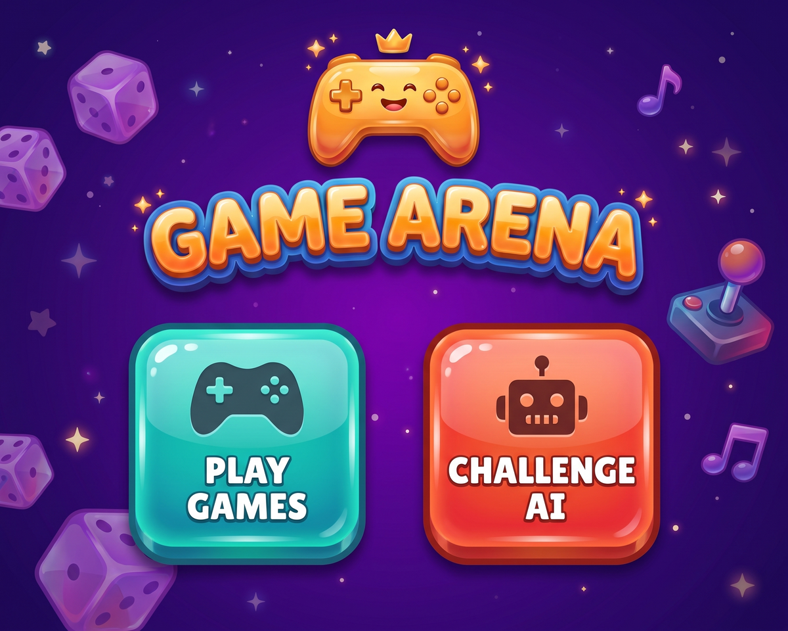
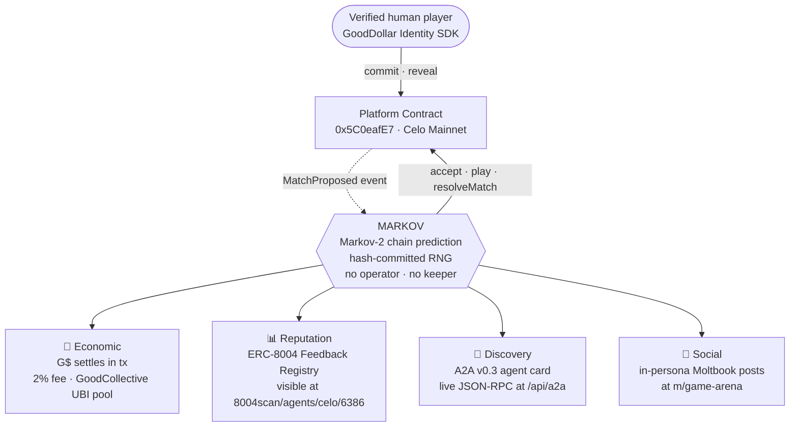

# GameArena

> A social on-chain community of verified humans playing mini-games for real rewards on Celo Mainnet. Skill leaderboards, seasonal cups, 1v1 wagers, and an autonomous AI opponent · all on-chain, all auditable.

[](https://gamearenahq.xyz)

[](https://gamearenahq.xyz)
[](https://t.me/gamearenaHQ)
[](https://celoscan.io/address/0x5C0eafE7834Bd317D998A058A71092eEBc2DedeE)
[](https://8004scan.io/agents/celo/6386)
[](https://karmahq.xyz/project/gamearena)

**Live:** [gamearenahq.xyz](https://gamearenahq.xyz)
**Community:** [t.me/gamearenaHQ](https://t.me/gamearenaHQ)
**Analytics:** [dune.com/ogazboiz/gamearena](https://dune.com/ogazboiz/gamearena)

---

## 60-second explainer

GameArena is where verified humans on Celo come to play. Every player is identity-verified via the GoodDollar Identity SDK before they can score, wager, or claim · no bots, no sybil, no farming. Three live game loops run in parallel · skill-based solo games (Rhythm Rush + Simon Memory), 1v1 wagers against MARKOV (an autonomous on-chain AI opponent), and seasonal team + solo competitions with real prize pools.

The economy runs on G$ from the GoodDollar stack. Prizes flow from the platform, from sponsor partners, and from community-funded pots. Solo wagers settle in the same tx that resolves the match. Season prizes pay out from sealed standings. Every score, settlement, and payout writes to Celo Mainnet · the chain is the source of truth, the leaderboards are just the UX.

Built community-first · auto-balanced team races, weekly + all-time skill ladders, daily missions, milestone achievements, tier badges, play streaks, and a habitat economy where players spend G$ on cosmetic upgrades that compound into season standings. Daily and seasonal action is announced through the [Telegram community](https://t.me/gamearenaHQ).

---

## Contents

- [How it works](#how-it-works)
  - [Verified humans only](#verified-humans-only)
  - [Solo games](#solo-games)
  - [MARKOV · autonomous on-chain AI opponent](#markov--autonomous-on-chain-ai-opponent)
  - [Events and seasonal competitions](#events-and-seasonal-competitions)
- [Progression](#progression)
  - [Player level and XP](#player-level-and-xp)
  - [Rank tiers](#rank-tiers)
  - [Pet evolution](#pet-evolution)
  - [Daily missions](#daily-missions)
  - [Milestone achievements](#milestone-achievements)
  - [Play streak](#play-streak)
- [Smart contracts](#smart-contracts)
- [G$ economics](#g-economics)
- [MiniPay](#minipay)
- [Tech stack](#tech-stack)
- [Running locally](#running-locally)
- [Project structure](#project-structure)
- [Public analytics](#public-analytics)

Component-level documentation lives inside each subdirectory · see [Project structure](#project-structure) for the full index.

---

## How it works

### Verified humans only

Every player completes a one-time face-scan via GoodDollar's Identity SDK before playing for stakes. No bots, no farms, no sybil scripts. Free-play is open to anyone · wagers and prize pools are gated to verified accounts.

### Solo games

| Game         | Goal                                  |
| ------------ | ------------------------------------- |
| Rhythm Rush  | Tap glowing buttons in time           |
| Simon Memory | Repeat color sequences                |

Every score is recorded on-chain via the GamePass contract · the backend signs the verified result (EIP-712) and the player submits the transaction from their own wallet. Every on-chain score is tied to the player's address and verifiable by anyone.

### MARKOV — autonomous on-chain AI opponent

MARKOV is an autonomous AI agent you can challenge 1v1 at any time. It auto-accepts your match, plays, and resolves the result · no human in the loop.

| Layer    | Mechanic                                                                                                                              |
| -------- | ------------------------------------------------------------------------------------------------------------------------------------- |
| Strategy | Markov-2 chains · predicts your next move from your last two                                                                          |
| Fairness | Hash-committed RNG · agent commits to its random seed at accept time and reveals at resolve, every match verifiable on-chain          |
| Identity | Registered on the Celo Agent Trust Protocol (ERC-8004), Token #6386                                                                   |
| Games    | Rock-Paper-Scissors, Coin Flip                                                                                                        |

Winner takes 98% of the pot. 2% routes to the GoodCollective UBI pool.

#### Architecture · four independent surfaces

Each match produces four parallel signals · economic settlement on-chain, an ERC-8004 reputation attestation, social activity on Moltbook, and discoverability for other agents over A2A. None of them depend on a human in the loop.



### Events and seasonal competitions

GameArena runs periodic competitions with G$ prize pools sourced from the platform, sponsors, or community-funded pots. Formats vary by event:

- **Team races** — players auto-balanced into teams via soft cap, racing to a target across the period. Tiered prizes to top teams.
- **Solo Ladders** — individual ranking competitions running alongside team events or standalone.
- **Sponsor cups** — rare, larger-pool events (typically in USDC) funded by sponsor partners.
- **Community-funded pots** — player-contributed prize pools, no platform money involved.

Points accumulate across each event from every in-app action · games played, wager wins, daily claims, habitat purchases, referrals, active days. Event cadence and structure are announced via the [Telegram community](https://t.me/gamearenaHQ).

---

## Progression

Three independent loops run in parallel · skill, grind, and daily ritual · so players always have something to chase.

### Player level and XP

XP is awarded per game: `+10` base, `+25` if you beat the win threshold, `+25` for a personal best. Mission claims add `+50` to `+120` XP.

Level curve follows the standard triangular formula · `totalXp(N) = 50·N·(N-1)`. LV 2 at 100 XP, LV 5 at 1,000, LV 10 at 4,500, LV 50 at 122,500. No cap.

### Rank tiers

Six metallic tiers, pyramid-distributed so elite ranks stay rare:

| Rank      | Tier      |
| --------- | --------- |
| #1        | MASTER    |
| #2–3      | DIAMOND   |
| #4–6      | PLATINUM  |
| #7–15     | GOLD      |
| #16–50    | SILVER    |
| #51+      | BRONZE    |

Tier is weekly-volatile · keeps competitive pressure active.

### Pet evolution

Every profile has a slime pet that evolves with player level · Egg → Baby → Teen → Crystal → King. Lives on the trainer card, reacts to taps.

### Daily missions

Three fresh missions every 24 hours, deterministically picked per `(wallet, date)`. Guaranteed mix · one easy, one win, one random. Same missions all day, new set tomorrow. Claim awards XP directly.

### Milestone achievements

A 13-achievement catalog covering first win, 3/7/30-day streaks, 5/25/100-game thresholds, and per-game score milestones. Profile shows `X / 13 UNLOCKED`. Schema reserves `nft_token_id` and `tx_hash` fields for future on-chain minting.

### Play streak

Consecutive-day play counter on every player. Shown as a glowing 🔥 chip in the sidebar (Duolingo pattern). Displayed on leaderboard rows at 2+ days.

---

## Smart contracts

Deployed on Celo Mainnet (chain id 42220).

| Contract             | Address                                                                                                                   | Purpose                                  |
| -------------------- | ------------------------------------------------------------------------------------------------------------------------- | ---------------------------------------- |
| `ArenaPlatform.sol`  | [`0x5C0eafE7834...`](https://celoscan.io/address/0x5C0eafE7834Bd317D998A058A71092eEBc2DedeE)                              | MARKOV match escrow                      |
| `GamePass.sol`       | [`0xBB044d6780...`](https://celoscan.io/address/0xBB044d6780885A4cDb7E6F40FCc92FF7b051DAdE)                              | Soulbound NFT + on-chain scores          |
| GoodDollar G$        | [`0x62B8B11039...`](https://celoscan.io/address/0x62B8B11039FcfE5aB0C56E502b1C372A3d2a9c7A)                              | Wager and payout currency                |
| ERC-8004 Registry    | [`0x8004A169FB4...`](https://celoscan.io/address/0x8004A169FB4a3325136EB29fA0ceB6D2e539a432)                              | MARKOV agent identity (Token #6386)     |
| GoodCollective UBI   | [`0x43d72Ff177...`](https://celoscan.io/address/0x43d72Ff17701B2DA814620735C39C620Ce0ea4A1)                              | 2% wager-fee destination                 |

---

## G$ economics

| Event                | Player                       | Fee                                            |
| -------------------- | ---------------------------- | ---------------------------------------------- |
| MARKOV match win     | Gets 98% of the pot          | 2% routes to the GoodCollective UBI pool       |
| MARKOV match loss    | Loses wager                  | 2% of the pot routes to GoodCollective UBI     |
| Daily UBI claim      | Verified players claim daily | —                                              |

Every MARKOV match contributes to the GoodCollective UBI pool · the 2% fee is the platform fee, and it is paid directly to GoodCollective, not retained by the platform.

---

## MiniPay

GameArena runs natively inside Opera MiniPay. MiniPay users auto-connect via the injected provider · no extra setup, no wallet extension. Fees are paid in USDC / USDT / USDm. No CELO required.

---

## Tech stack

| Layer            | Technology                                                  |
| ---------------- | ----------------------------------------------------------- |
| Frontend         | Next.js 16 (App Router), React 19, wagmi v3, viem v2        |
| Smart contracts  | Solidity, Foundry, OpenZeppelin                             |
| Backend          | Express.js + ethers.js v6, Supabase (PostgreSQL)            |
| Identity         | GoodDollar Identity SDK + ERC-8004 Agent Trust Protocol     |
| AI agent         | TypeScript · Markov-2 chains · hash-committed RNG           |
| Auth             | Privy (email, social, embedded wallets)                     |
| Chain            | Celo Mainnet (chain id 42220)                               |

---

## Running locally

```bash
cd frontend
cp .env.local.example .env.local   # fill in your keys
npm install
npm run dev
```

In separate terminals:

```bash
cd games-backend && npm install && node server.js   # http://localhost:3005
cd agent && npm install && npm start                # MARKOV agent
```

Required environment variables: Privy app id, Supabase URL + anon key, contract addresses (Celo Mainnet), validator private key for the backend. See each subdirectory's `.env.example`.

---

## Project structure

```
GameArenaCelo-/
  contracts/        Solidity sources · ArenaPlatform, SoloWager, GamePass
  frontend/         Next.js 16 · game UI, wallet, wager flow
  games-backend/    Express + Supabase · scores, seasons, push, validator
  agent/            MARKOV agent · Markov-2 chains, hash-committed RNG
  scripts/          Deployment + utility scripts
  subgraph/         The Graph indexing (optional)
```

Each subdirectory has its own README · open one for the deeper picture:

- **[agent/README.md](agent/README.md)** · MARKOV's four-layer architecture (Economic · Reputation · Discovery · Social), on-chain anchors, configuration matrix, operational notes
- **[games-backend/README.md](games-backend/README.md)** · Express routes, score-voucher pipeline, season + cup engine, push broadcast, Supabase schema
- **[frontend/README.md](frontend/README.md)** · Next.js 16 app, wallet integration, page structure
- **[contracts/README.md](contracts/README.md)** · Solidity sources, Foundry setup, deployment
- **[subgraph/README.md](subgraph/README.md)** · Goldsky subgraph for on-chain reads
- **[scripts/README.md](scripts/README.md)** · Utility scripts (anti-cheat tester, etc.)

---

## Public analytics

All player counts, game volume, and contract activity are queryable live via [dune.com/ogazboiz/gamearena](https://dune.com/ogazboiz/gamearena). The chain is the source of truth · no proprietary metrics, no off-chain accounting.

---

*Built on Celo. Powered by GoodDollar G$. Verified humans only.*
