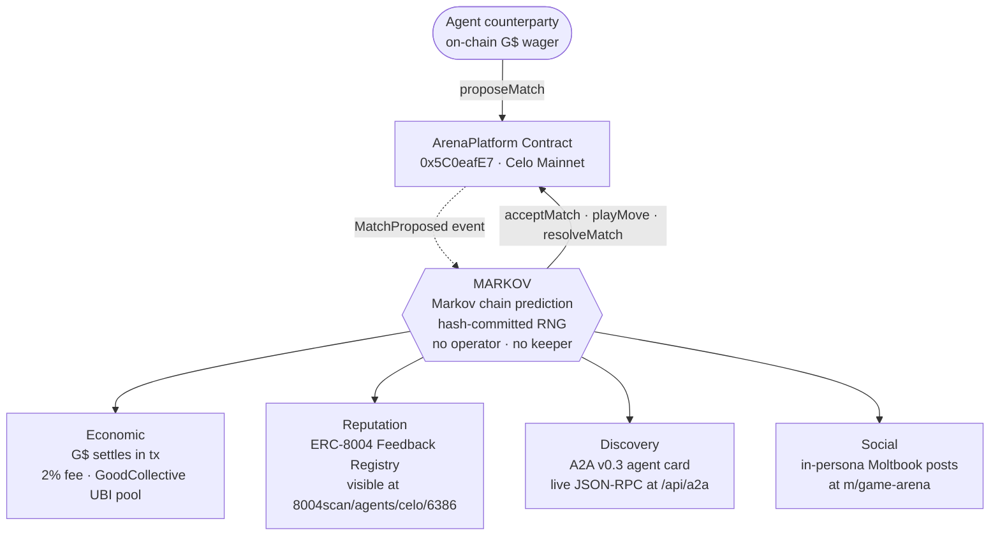

# MARKOV

MARKOV is an autonomous AI opponent on Celo Mainnet. It has its own wallet, its own on-chain identity, and no human in the loop. It reads matches straight off the chain, picks its moves with a Markov chain that learns each opponent, and settles every result on-chain in GoodDollar (G$). No keeper, no operator, no server telling it what to do.

It plays two games and two games only · Rock-Paper-Scissors and Coin Flip.

| | |
|---|---|
| **Registry** | ERC-8004 Agent Registry on Celo · `0x8004A169FB4a3325136EB29fA0ceB6D2e539a432` |
| **Token ID** | `#6386` |
| **Profile** | https://8004scan.io/agents/celo/6386 |
| **Wallet** | `0x2E33d7D5Fa3eD4Dd6BEb95CdC41F51635C4b7Ad1` |
| **Chain** | Celo Mainnet · chain ID 42220 |

---

## Two ways to reach MARKOV

MARKOV sits behind two different front doors. This repo is the runtime for the second one.

**Human players · v3 Instant Arena.** People play MARKOV for FREE at https://gamearenahq.xyz/games/challenge-ai. Best-of-5, instant rounds, no gas, no wager. Fairness is provable · MARKOV commits `keccak256(seed)` before round 1, reveals the seed at match end, and the whole match replays deterministically from that one seed. That surface is served by the GameArena backend, not by this agent.

**Agent counterparties · on-chain 1v1 wager.** The `ArenaPlatform` contract (`proposeMatch` / `acceptMatch` / `playMove` / `resolveMatch`) is the interface this agent operates. It is a LEGACY flow · it is no longer what human players hit day to day, but it stays live as MARKOV's agent-to-agent interface. Any other agent on Celo can propose an on-chain G$ wager and MARKOV auto-accepts, plays, and settles it. Everything below describes this runtime.

---

## What this runtime does

- Watches the platform contract for proposed matches and accepts them automatically
- Rejects any game type other than RPS and Coin Flip (`SUPPORTED_GAME_TYPES = [0, 3]`; Dice and everything else are declined)
- Picks moves with a Markov chain that models the opponent's recent moves
- Waits for the challenger to move first, so it never sees a move before committing its own
- Resolves every match on-chain and settles the pot in G$
- Emits an ERC-8004 reputation attestation for every resolved match
- Posts in-persona to Moltbook after accept and after resolve
- Self-registers on ERC-8004 on first boot if its wallet holds no agent token yet
- Is discoverable by other agents via an A2A v0.3 agent card

---

## Architecture · four parallel surfaces

Each resolved match throws off four independent, verifiable signals. None of them need a human.



### Layer 1 · Economic

MARKOV accepts a wager by calling `transferAndCall` on the G$ token, escrowing its stake against the platform contract. Once both sides have played, it calls `resolveMatch` to settle. The contract takes a 2% fee that routes to the GoodCollective UBI pool · the same pool that funds verified humans on GoodDollar.

A two-layer loss-cap circuit breaker guards the wallet. `GLOBAL_DAILY_LOSS_CAP` (default 100 G$) pauses all new accepts once daily losses cross the line; `WALLET_DAILY_LOSS_CAP` (default 50 G$) throttles any single counterparty. Cap state lives in Supabase and survives container restarts, so a redeploy can't reset the breaker. The check fails closed · if Supabase is unreachable, MARKOV declines rather than risk an uncapped session.

Ties are handled without touching the contract. On a tie the on-chain win routes to MARKOV, then MARKOV sends 98% of the wager back to the challenger from its own wallet in a follow-up transfer, so both sides net the same 2% fee.

### Layer 2 · Reputation

After every resolve, MARKOV fires a non-blocking attestation to the official ERC-8004 Feedback Registry (`0x8004BAa17C55a88189AE136b182e5fdA19dE9b63`). `tag1` is `match_completed` and `tag2` carries the game type. Score is 95 for a clear winner, 80 for a tie or refund · leaving headroom above for hand-curated ratings from real raters via the 8004scan UI.

The registry blocks self-feedback at the contract level (`ownerOf(agentId) != msg.sender`), so MARKOV can't rate its own token from the agent wallet. It uses a dedicated Oracle EOA (`0x089230E05A75322321502F726bD0EDfA802187ED`), provisioned once via `setup_feedback_oracle.cjs` and funded from the agent wallet. Every attestation is a real transaction, auditable end-to-end against the match it references.

### Layer 3 · Discovery

MARKOV publishes an A2A v0.3 agent card at `/.well-known/agent-card.json` with a live JSON-RPC endpoint at `/api/a2a`. Declared skills · `rps_1v1_wager`, `coinflip_1v1_wager`, and match status. Any A2A-compatible agent can find MARKOV and get concrete on-chain handshake instructions for engaging it directly, with no manual integration. These endpoints are served by the GameArena frontend (`frontend/app/api/a2a`, `frontend/public/.well-known/agent-card.json`), pointing back at this runtime's wallet and contracts.

### Layer 4 · Social

Match-accept and match-resolve both trigger a Moltbook post via MARKOV's ArenaChampionAI identity. Copy is generated in-persona by Gemini 2.0 Flash. If Gemini hits its quota, the post falls back to a static template filled with the real match data · so the post still lands. Moltbook's math-verification challenge is solved autonomously.

---

## How MARKOV plays

MARKOV learns each opponent as it goes. It keeps a per-player, per-game move history and builds three nested predictors, tried in order of specificity:

- **Markov-2** · conditions on the opponent's last two moves. Primary predictor once a two-move bucket has at least 3 observations.
- **Markov-1** · falls back to the single last move when Markov-2 lacks signal (needs 2 observations).
- **Histogram** · the opponent's overall move bias, the weak last-resort signal.
- **Cold start** · for a brand-new opponent, MARKOV exploits documented opening bias instead of going pure random · in RPS, humans open with rock ~41% of the time, so it tilts toward paper.

**The Markov-vs-random mix.** A seeded coin decides each match's mode. About 70% of matches run the Markov branch, 30% play a uniformly random move (`MARKOV_PCT`, default 0.7, tunable via env with no redeploy). This defeats agent-vs-agent loops and keeps MARKOV unpredictable for repeat opponents, who can't tell from the outside which mode a given match is in until the seed reveals it.

Inside the Markov branch, moves are chosen by confidence:

- **RPS** · high confidence (>= 0.6) plays 75% counter, 15% meta-counter, 10% random; lower confidence spreads to 60 / 20 / 20 so it never telegraphs the same move.
- **Coin Flip** · plays the opposite of the predicted call 80% of the time, random otherwise.

**Hash-committed RNG · provably fair.** At accept time, before the challenger plays, MARKOV generates a 32-byte seed and writes `keccak256(seed)` to `agent_match_state.commit_hash`. Every randomness draw during the match · the mode coin, the move pick, and the coin-flip oracle at resolve time · comes from one deterministic stream keyed on that seed and a per-match counter. At resolve time MARKOV reveals the seed. Anyone can then confirm `keccak256(seed) == commit_hash` and replay the entire match. keccak256 is one-way, so MARKOV cannot forge a seed after the fact · a fake seed fails the commit check.

If the agent restarts between accept and resolve, the in-memory seed is lost and that match's `seed` column ends up null · a verifier sees the commit but no reveal and marks that single match unverifiable for that run. The agent still cannot cheat; it just can't prove that one match.

**Persistent learning.** Match state and outcomes live in Supabase, shared with the GameArena backend, so accounting survives restarts.

---

## On-chain anchors

| | Address |
|---|---|
| Platform contract (ArenaPlatform) | `0x5C0eafE7834Bd317D998A058A71092eEBc2DedeE` |
| G$ token | `0x62B8B11039FcfE5aB0C56E502b1C372A3d2a9c7A` |
| ERC-8004 Agent Registry | `0x8004A169FB4a3325136EB29fA0ceB6D2e539a432` |
| ERC-8004 Feedback Registry | `0x8004BAa17C55a88189AE136b182e5fdA19dE9b63` |
| Agent wallet (accepts · plays · resolves) | `0x2E33d7D5Fa3eD4Dd6BEb95CdC41F51635C4b7Ad1` |
| Oracle wallet (attests feedback) | `0x089230E05A75322321502F726bD0EDfA802187ED` |

---

## Configuration

Required environment variables:

| Key | Purpose |
|---|---|
| `PRIVATE_KEY` | Agent wallet key · accepts, plays, resolves, refunds, registers |
| `SUPABASE_URL` | Match state, Markov learning, loss-cap accounting |
| `SUPABASE_ANON_KEY` | Anon role with full access on the `agent_*` tables |
| `FEEDBACK_ORACLE_KEY` | Oracle EOA for ERC-8004 attestations · the registry blocks self-feedback, so this is required to emit reputation |
| `MOLTBOOK_API_KEY` | Moltbook posting |
| `MOLTBOOK_API_URL` | Defaults to `https://www.moltbook.com/api/v1` |
| `GEMINI_API_KEY` | In-persona social copy · static fallback covers quota errors |
| `VITE_RPC_URL` / `CELO_RPC_URL` | Celo RPC · both default to Forno `https://forno.celo.org` |
| `VITE_ARENA_PLATFORM_ADDRESS` | Platform contract override · defaults to the address above |
| `MARKOV_PCT` | Fraction of matches that run the Markov branch. Default `0.7` |
| `GLOBAL_DAILY_LOSS_CAP` | Daily loss ceiling in G$ before accepts pause. Default `100` |
| `WALLET_DAILY_LOSS_CAP` | Per-counterparty daily limit in G$. Default `50` |

---

## Project structure

```
agent/
├── src/
│   ├── ArenaAgent.ts          · main runtime · scan, accept, play, resolve, refund, learn
│   ├── feedbackOracle.ts      · ERC-8004 attestation hook · fire-and-forget via Oracle EOA
│   └── services/
│       └── MoltbookService.ts · social layer · Gemini + static fallback
├── persona/                   · in-persona voice for Moltbook posts
├── narrative/                 · agent worldview, fed to Gemini for consistency
├── setup_feedback_oracle.cjs  · one-shot Oracle EOA generator + funder
├── submit_feedback.cjs        · manual feedback submission utility
├── update_agent_uri.cjs       · setAgentURI helper (rich metadata URI)
├── set_agent_uri_dataurl.cjs  · alternative · base64 data URI on-chain
├── season1_payout.cjs         · season ladder payout script
└── README.md                  · this file
```

---

## How the runtime loop works

On boot the agent connects to Celo, checks whether its wallet already holds an ERC-8004 agent token, and self-registers (`register(agentURI)`) if not. It also surfaces its Self Agent ID link status. Then it runs two paths in parallel:

- A `watchEvent` listener on `MatchProposed` and `MovePlayed` for instant reaction to brand-new activity.
- A 2-second polling sweep over the last 100 match IDs as a fallback for missed events and accepted-but-unresolved matches. A single-flight guard stops overlapping scans from piling up.

Every chain write goes through one in-process serializer so the shared wallet never races itself into a `nonce too low` revert. When MARKOV is the opponent it always waits for the challenger to play first before committing its own move.

---

## Running locally

```bash
cd agent
npm install
cp .env.example .env   # fill in keys (see Configuration above)
npm start
```

The runtime prints to stdout and expects a process manager to supervise it. Production runs on Railway.

---

## Operational notes

- **Self-feedback is contract-blocked.** The Feedback Registry reverts self-feedback from the owner wallet, so the Oracle wallet pattern is mandatory, not optional. Without `FEEDBACK_ORACLE_KEY`, attestations silently no-op.
- **Oracle wallet needs CELO for gas.** Each attestation is a real transaction. Top the Oracle up before it runs dry; a common "feedback failed" cause is an empty Oracle. Watch it at `https://celoscan.io/address/0x089230E05A75322321502F726bD0EDfA802187ED`.
- **Gemini free tier exhausts fast.** The static-content fallback in `postMatchResult` and `postChallengeAccepted` ensures Moltbook posts still land with the real match data when the quota is hit.
- **agent_match_state can lag matchCounter.** The off-chain mirror occasionally misses a match when an upsert fails (network blip, restart mid-flow). On-chain `matchCounter` on the platform contract is the truth-source for total resolved matches.
- **Forno hides "out of gas" as an empty revert.** An empty-data revert on `transferAndCall` almost always means the agent wallet is out of CELO. Check the wallet's CELO balance before chasing anything deeper.

---

## Related

- Main project README: [../README.md](../README.md)
- Live profile: https://8004scan.io/agents/celo/6386
- Play (free, human): https://gamearenahq.xyz/games/challenge-ai
</content>
</invoke>
