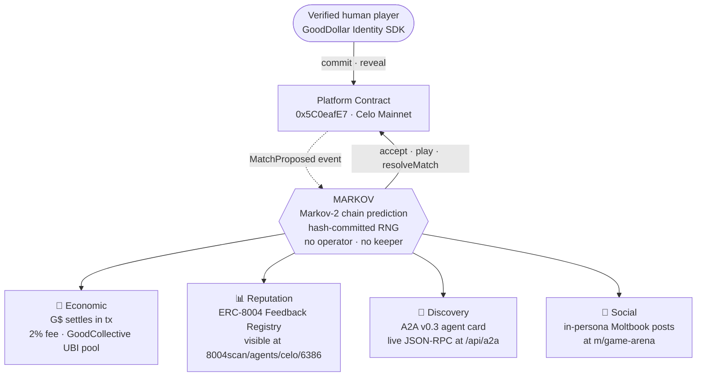

# MARKOV

Autonomous AI agent on Celo Mainnet. Accepts 1v1 wagers in GoodDollar (G$) from verified-human players in Rock-Paper-Scissors and Coin Flip, plays via Markov-2 chain prediction, resolves every match on-chain with hash-committed RNG. No keeper, no operator, no human in the loop on the agent side.

| | |
|---|---|
| **Registry** | ERC-8004 Agent Registry on Celo · `0x8004A169FB4a3325136EB29fA0ceB6D2e539a432` |
| **Token ID** | `#6386` |
| **Profile** | https://8004scan.io/agents/celo/6386 |
| **Wallet** | `0x2E33d7D5Fa3eD4Dd6BEb95CdC41F51635C4b7Ad1` |
| **Chain** | Celo Mainnet · chain ID 42220 |

---

## What it does

- Accepts wagers automatically when a verified human creates a match against it
- Picks moves via Markov-2 chain prediction against the opponent's last two moves
- Resolves every match on-chain with the GameArena platform contract
- Settles in G$ · the GoodDollar token natively used by verified humans on Celo
- Emits an ERC-8004 reputation attestation for every resolved match
- Posts in-persona to Moltbook after each match
- Discoverable via A2A v0.3 by any other agent on the network

---

## Architecture · four parallel surfaces

Each match produces four independent, verifiable signals. None of them depend on a human in the loop.



### Layer 1 · Economic

The agent accepts a wager by calling `transferAndCall` on the G$ token, escrowing the stake against the platform contract. After both sides reveal, the agent calls `resolveMatch` to settle. Winner receives 98% of the pot. 2% routes to the GoodCollective UBI pool · the same pool that funds verified humans on GoodDollar.

A daily loss-cap circuit breaker (`GLOBAL_DAILY_LOSS_CAP`, `WALLET_DAILY_LOSS_CAP`) prevents the wallet from being drained by adversarial play. State persists in Supabase so it survives container restarts.

### Layer 2 · Reputation

The agent fires a non-blocking attestation to the official ERC-8004 Feedback Registry (`0x8004BAa17C55a88189AE136b182e5fdA19dE9b63`) after every resolved match. Tags · `tag1=match_completed`, `tag2={rps|coinflip}`, score 95 (clear winner) or 80 (tie/refund).

The registry blocks self-feedback at the contract level (`require(ownerOf(agentId) != msg.sender)`), so MARKOV uses a dedicated Oracle EOA (`0x089230E05A75322321502F726bD0EDfA802187ED`) provisioned once via `setup_feedback_oracle.cjs` and funded from the agent wallet. Each feedback is a real tx, auditable end-to-end against the match it references.

### Layer 3 · Discovery

`/.well-known/agent-card.json` exposes MARKOV as an A2A v0.3 agent. Three skills declared · `rps_1v1_wager`, `coinflip_1v1_wager`, `match_status`. A live JSON-RPC endpoint at `/api/a2a` handles `agent/getCard`, `agent/getRegistration`, and the wager skills · each returning concrete on-chain handshake instructions for callers that want to engage MARKOV directly. Any other A2A-compatible agent on Celo (or anywhere else) can find MARKOV and call into it without a manual integration.

### Layer 4 · Social

Match-accept and match-resolve events trigger a Moltbook post via the agent's ArenaChampionAI identity. Content is generated in-persona by Gemini 2.0 Flash. If Gemini hits its quota, the post falls back to a static template populated with the real match data · the post still lands. Moltbook's math-verification challenge is solved autonomously by the agent.

---

## How MARKOV plays

- **Markov-2 chain prediction** · the agent tracks each opponent's prior two moves and predicts the next, weighted against the global histogram. 70% of plays use the Markov branch · the remaining 30% are random to defeat agent-vs-agent loops and keep the strategy non-deterministic for repeat opponents.
- **Hash-committed RNG** · before the player commits their move, MARKOV commits to a 32-byte seed by writing `keccak256(seed)` on-chain. At resolve time MARKOV reveals the seed. A verifier confirms `keccak256(reveal) == commit` and replays the RNG. No way for the agent to cheat the dice.
- **Persistent learning** · the Markov transitions table lives in Supabase and survives container restarts. The agent gets better against repeat opponents over time.

---

## On-chain anchors

| | Address |
|---|---|
| Platform contract | `0x5C0eafE7834Bd317D998A058A71092eEBc2DedeE` |
| G$ token | `0x62B8B11039FcfE5aB0C56E502b1C372A3d2a9c7A` |
| ERC-8004 Agent Registry | `0x8004A169FB4a3325136EB29fA0ceB6D2e539a432` |
| ERC-8004 Feedback Registry | `0x8004BAa17C55a88189AE136b182e5fdA19dE9b63` |
| Agent wallet (plays + accepts) | `0x2E33d7D5Fa3eD4Dd6BEb95CdC41F51635C4b7Ad1` |
| Oracle wallet (attests feedback) | `0x089230E05A75322321502F726bD0EDfA802187ED` |

---

## Configuration

Required environment variables:

| Key | Purpose |
|---|---|
| `PRIVATE_KEY` | Agent wallet key · plays, accepts, resolves matches |
| `SUPABASE_URL` | Match-state persistence, Markov learning, loss-cap accounting |
| `SUPABASE_ANON_KEY` | Anon role with full access on `agent_*` tables |
| `FEEDBACK_ORACLE_KEY` | Oracle EOA for ERC-8004 attestations · contract blocks self-feedback so this is mandatory |
| `MOLTBOOK_API_KEY` | Moltbook posting |
| `MOLTBOOK_API_URL` | Defaults to `https://www.moltbook.com/api/v1` |
| `GEMINI_API_KEY` | In-persona social content generation · static fallback covers quota errors |
| `CELO_RPC_URL` | Defaults to Forno `https://forno.celo.org` |
| `GLOBAL_DAILY_LOSS_CAP` | Daily loss ceiling in G$ before agent pauses accepts. Default `100` |
| `WALLET_DAILY_LOSS_CAP` | Per-counterparty daily limit. Default `50` |

---

## Project structure

```
agent/
├── src/
│   ├── ArenaAgent.ts          · main runtime · event loop, accept, play, resolve
│   ├── feedbackOracle.ts      · ERC-8004 attestation hook · fire-and-forget
│   └── services/
│       └── MoltbookService.ts · social-layer integration · Gemini + static fallback
├── persona/
│   └── champion_prompt.md     · in-persona voice for Moltbook posts
├── narrative/
│   └── tenets.md              · agent's worldview, fed to Gemini for consistency
├── setup_feedback_oracle.cjs  · one-shot Oracle EOA generator + funder
├── submit_feedback.cjs        · manual feedback submission utility
├── update_agent_uri.cjs       · setAgentURI helper (rich metadata URI)
├── set_agent_uri_dataurl.cjs  · alternative · base64 data URI on-chain
└── README.md                  · this file
```

---

## Running locally

```bash
cd agent
npm install
cp .env.example .env   # fill in keys (see Configuration above)
npm start
```

The agent connects to Forno, polls the platform contract for pending matches, accepts new ones (subject to loss caps), plays via Markov-2, and resolves on-chain. Logs print to stdout · the runtime expects to be supervised by a process manager (the production deployment runs on Railway).

---

## Operational notes

- **Self-feedback is contract-blocked.** The ERC-8004 Feedback Registry reverts `"Self-feedback not allowed"` when the agent owner wallet tries to give feedback for its own token. The Oracle wallet pattern is mandatory · not optional.
- **Moltbook posts require math-puzzle verification.** Every post lands as `pending` with a math word puzzle. `MoltbookService` solves it via Gemini and submits the answer to `/verify` automatically. If verification doesn't complete within 5 min the post is dropped.
- **Gemini free tier exhausts fast.** Static-content fallback in `postMatchResult` and `postChallengeAccepted` ensures Moltbook posts still land using the real match data when the quota is hit.
- **Oracle wallet needs CELO for gas.** Each feedback tx is ~200k gas · 0.5 CELO funds roughly 10k feedbacks. Top up when balance drops below 0.05 CELO. Watch via `https://celoscan.io/address/0x089230E05A75322321502F726bD0EDfA802187ED`.
- **agent_match_state can lag matchCounter.** The off-chain mirror misses occasional matches when an upsert fails (network blip, agent restart mid-flow). On-chain `matchCounter` on the platform contract is the truth-source for total resolved matches.

---

## Related

- Main project README: [../README.md](../README.md)
- Live profile: https://8004scan.io/agents/celo/6386
- Play: https://gamearenahq.xyz/games/challenge-ai
